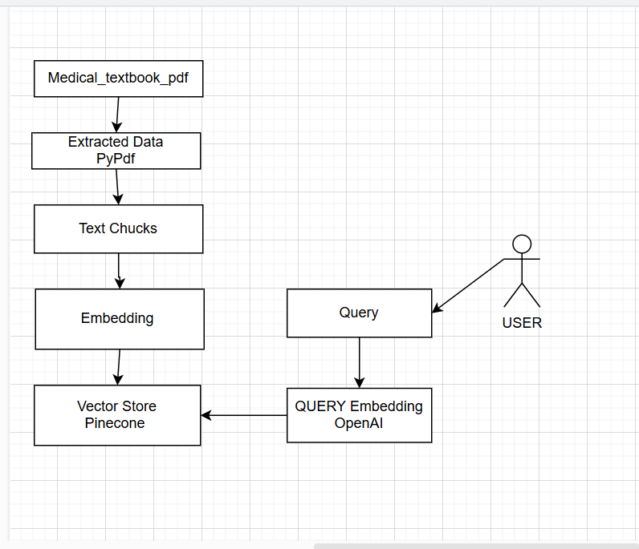

# Medical Chatbot - Generative AI Project

## Overview

This project is a **Medical Assistance Chatbot** that provides answers to medical-related queries using **Generative AI**. It processes and understands user queries through **natural language processing (NLP)** and retrieves relevant medical information.

The project is built with:

- **Flask** for the web interface and API
- **Pinecone** for vector-based retrieval
- **LangChain** for handling LLM integrations
- **OpenAI API** for generating responses
- **Sentence Transformers** for embeddings

## Project Structure

```
Medical_Chatbot/
│── Data/
│   ├── Medical_book.pdf
│── medicalbot/
│── research/
│   ├── trial.ipynb
│── src/
│   ├── __pycache__/
│   ├── __init__.py
│   ├── helper.py
│   ├── prompt.py
│── static/
│   ├── medical_logo.png
│   ├── styles.css
│── templates/
│   ├── chat.html
│── .env
│── .gitignore
│── app.py
│── LICENSE
│── README.md
│── requirements.txt
│── setup.py
│── store_index.py
│── template.py
```

## Setup Instructions

### 1. Create and Activate Virtual Environment

#### **Using Python Virtualenv**

```sh
python -m venv medicalbot
source medicalbot/bin/activate   # For MacOS/Linux
medicalbot\Scripts\activate      # For Windows
```

#### **Using Conda**

```sh
conda create --name medicalbot python=3.9
conda activate medicalbot
```

### 2. Install Dependencies

```sh
pip install -r requirements.txt
```

### 3. Run the Application

```sh
python app.py
```

The chatbot will be available at **http://127.0.0.1:5000**.

## Project Workflow



## Future Enhancements

- **AWS Deployment** – Deploying the chatbot using AWS services (Lambda, API Gateway, ECS).
- **Fine-tuning on Medical Data** – Training the model with medical-specific datasets for better accuracy.
- **Voice Assistant Integration** – Adding speech-to-text functionality.
- **Multi-language Support** – Enhancing accessibility by supporting multiple languages.

- 
## Chatbot Interface


## License

This project is licensed under the **MIT License**.

## About Me

Hello! I am a **passionate AI and Machine Learning enthusiast** with a strong background in **Data Science and Natural Language Processing (NLP)**. My expertise lies in building intelligent AI systems, deploying machine learning models, and working with **LLMs, vector databases, and cloud computing**.

Always open to learning, collaborating, and exploring innovative AI solutions!
